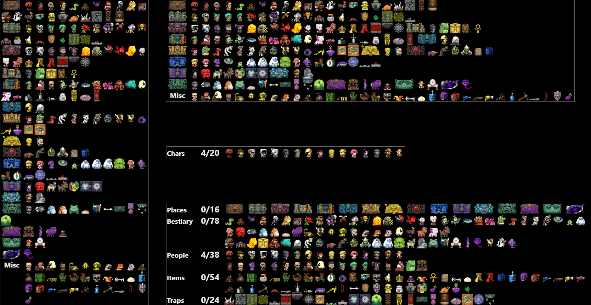

# s2tracker
Journal tracker for Spelunky 2 RTA speedrun categories.



## Installation
Run from source:
```
cd s2tracker
npm install
node index.js
```
Or just [get the release](https://github.com/Dregu/s2tracker/releases/latest) with nodejs packaged in.

## Usage

1. Start s2tracker
2. Start livesplit with the tracker option enabled in Spelunky 2 autosplitter
3. Start the game

- Go to http://localhost:27122/ for a category view.
- Go to http://localhost:27122/#area to arrange everything by their probable area found.
- Go to http://localhost:27122/#char for a character tracker.
- Go to http://localhost:27122/#people etc or click on the category names to show just one category.

The tracker also works from your local network if you use your lan ip, on a tablet for example.

These are designed for OBS Browser, so they might look a little goofy in your regular one.

Click on the icons to hide them manually, if you're not using livesplit for some reason. Refresh to reset in that case.

### Custom CSS tweaks
You can add some custom CSS in OBS to edit the appearance a bit.
```css
/* Put all areas back on their own row (This is done automatically though when width < 800px) */
.cat { clear: both!important; }

/* Align to top instead of bottom */
#journal { top: 0; }

/* Don't wrap item rows even if they don't fit */
.items { flex-wrap: nowrap; }

/* Put things in category view back in journal order and on single rows */
.item { order: 0!important; }

/* Hide places in category view */
#places { display: none; }
```
Check [main.css](https://github.com/Dregu/s2tracker/blob/master/static/main.css) for some more ideas.
